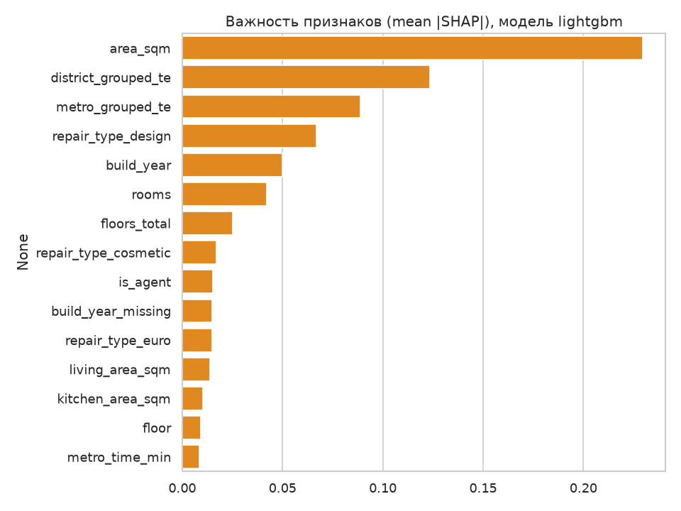
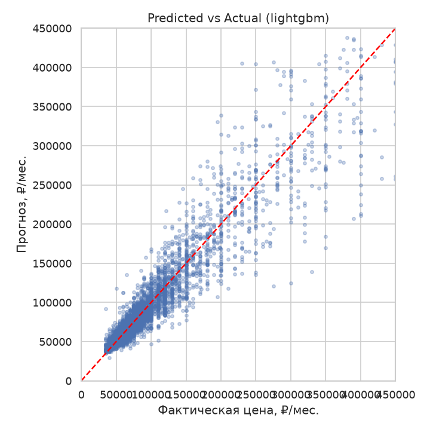
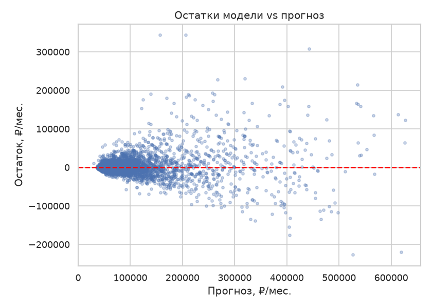
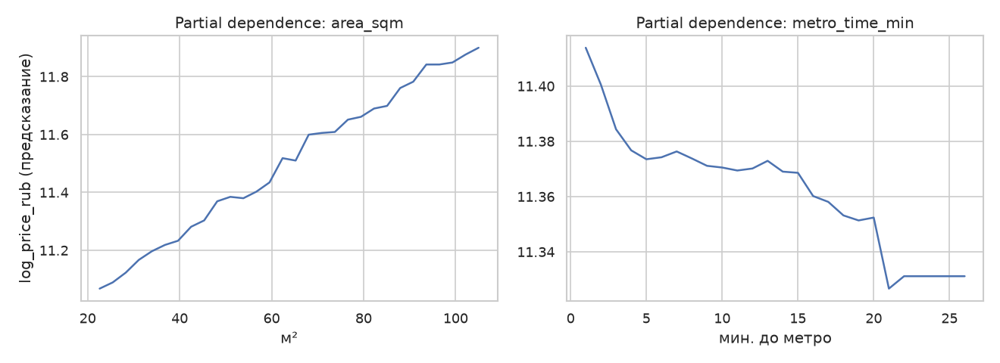
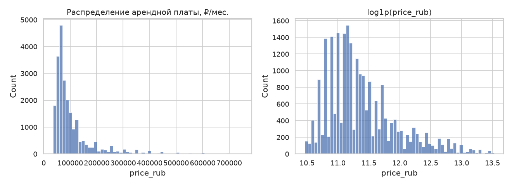
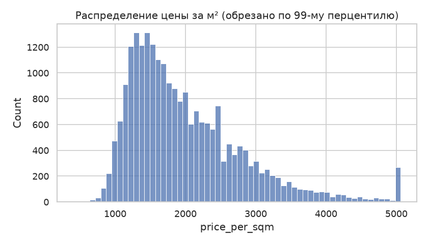
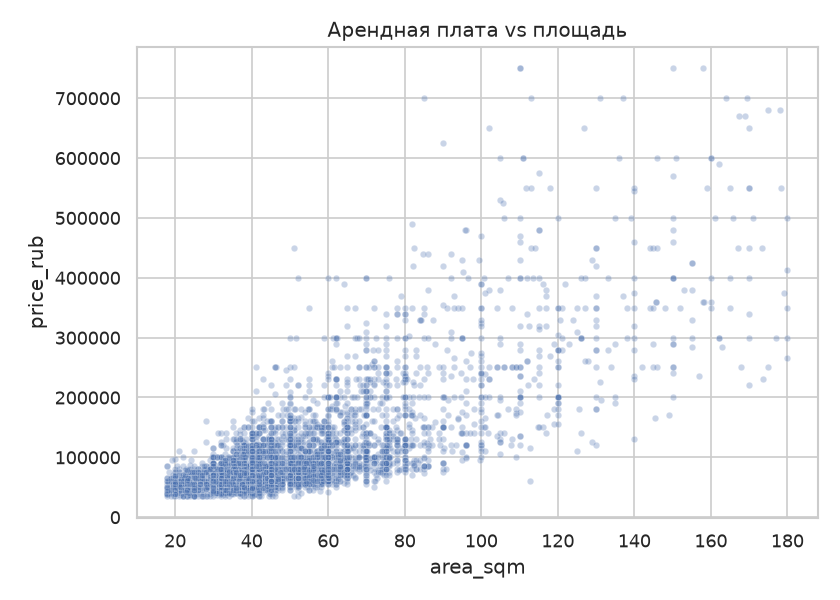
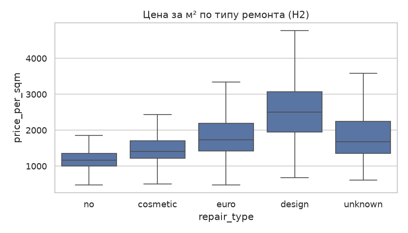
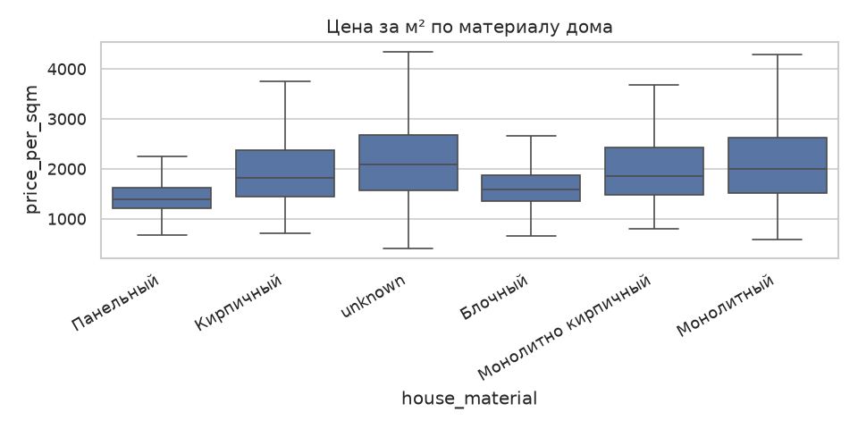
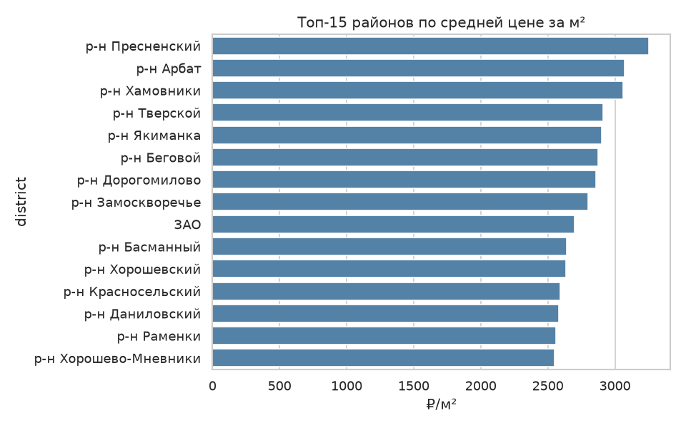

# econ-housing-price-ml

Прогноз арендной платы за квартиру на рынке Москвы. Полный ML-пайплайн: очистка данных, feature engineering, обучение и сравнение моделей, интерпретация через SHAP, визуализация.

Постановка задачи, источники данных и ограничения — в [ТЗ.md](./ТЗ.md). Полный отчёт с ответами на гипотезы — в [notebooks/report.md](./notebooks/report.md).

## Данные

Источник — объявления об аренде квартир в Москве, выгруженные с cian.ru (датасет [`beldmian/moscow-rent-cian-with-images`](https://www.kaggle.com/datasets/beldmian/moscow-rent-cian-with-images), Kaggle, лицензия CC0-1.0). После очистки — 23 160 объявлений, преимущественно май–июнь 2026.

## Результаты

| Модель | RMSE, ₽/мес. | MAE, ₽/мес. | RMSLE | R² |
|---|---|---|---|---|
| **LightGBM** | **29 059** | **15 132** | **0.168** | **0.884** |
| RandomForest | 30 327 | 15 802 | 0.180 | 0.873 |
| Ridge (baseline) | 37 731 | 19 131 | 0.209 | 0.804 |

Главные факторы цены по SHAP-важности — площадь, район, станция метро и тип ремонта.

## Графики

**Важность признаков (SHAP) и качество прогноза**


*SHAP-важность признаков лучшей модели (LightGBM): площадь, район и станция метро — главные факторы цены.*


*Прогноз vs фактическая цена на тесте — точки концентрируются вдоль диагонали (R²=0.884).*


*Остатки модели относительно прогноза — видна гетероскедастичность: разброс ошибок растёт с ценой.*


*Partial dependence по ключевым признакам — например, цена монотонно убывает с увеличением времени до метро.*

**Данные: цена и её зависимость от характеристик объекта**


*Распределение арендной платы (₽/мес.) после очистки — скошено вправо, что обосновывает логарифмирование цели.*


*Распределение цены за м² — более устойчивый показатель для сравнения объектов разной площади.*


*Зависимость цены от площади — основная и самая сильная связь в данных (corr=0.75).*


*Цена за м² по типу ремонта — строго монотонный рост: `no` → `cosmetic` → `euro` → `design`.*


*Цена за м² по материалу дома — различия между панельными, кирпичными и монолитными домами.*


*Топ-15 районов Москвы по средней цене за м² — отражает географическую премию центральных и престижных районов.*

## Структура проекта

```
ТЗ.md                  постановка задачи, источники данных, методология
notebooks/report.md    результаты и ответы на гипотезы
src/                   скрипты пайплайна (02_clean_data.py ... 07_visualize.py)
output/figures/        графики
output/tables/         метрики, аудит данных, таблицы интерпретации
data/processed/        промежуточные и итоговые данные, обученные модели
```

## Установка

```bash
python3 -m venv .venv && source .venv/bin/activate
pip install -r requirements.txt
```

## Скачивание данных

`data/raw/` не входит в репозиторий — основной файл датасета (108 МБ) превышает лимит GitHub на размер файла. Нужен бесплатный личный токен Kaggle (`https://www.kaggle.com/settings/api`):

```bash
export KAGGLE_API_TOKEN=<ваш токен>

kaggle datasets download beldmian/moscow-rent-cian-with-images -f moscow_rent_all.csv -p data/raw
kaggle datasets download egorkainov/moscow-housing-price-dataset -p data/raw --unzip
```

Второй датасет (продажа квартир, ноябрь 2023) — резервный, не используется в основном пайплайне (см. ТЗ.md, п. 2.2).

## Запуск пайплайна

```bash
for f in src/0[2-7]_*.py; do python3 "$f"; done
```

`data/processed/models/random_forest.joblib` (267 МБ) также не входит в репозиторий и пересоздаётся этой командой детерминированно (`random_state=42`).

## Лицензия данных

CC0-1.0 (основной датасет) / MIT (резервный датасет). Код — без отдельной лицензии, использование в учебных целях.
